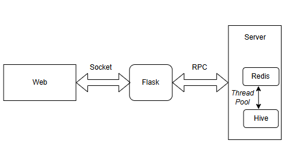

# shareMarkdown
# 多人在线共享文档

以下是我们的服务架构：

* 前端基于web，提供Markdown的在线编辑与实时预览功能

* 后端server使用Redis实时保存数据，然后使用线程池ThreadPool往Hive中保存数据，使用分布式存储以保证文档的一致性等。

* 中间的Flask使用Socket与Web通信，回应Web的文档读、写请求；使用RPC来调用Server所提供的功能。

## 环境
* 我们使用3台Centos的虚拟机分别为node1,node2和node3,在该三个节点上部署Hadoop，Yarn，Hive以及分布式锁ZooKeeper。
* 在运行server_hive.py(即server)的node1上部署Redis。
* Python3环境
    - Flask
    - Redis
    - grpc

    直接使用pip或conda安装等相关库

## 运行
* Back_End中运行后端
    - 首先运行 init.sh 初始化环境，启动hive，zookeeper等相关软件

        注意init.sh中的路径名应换成自己的相关安装路径
    - 运行 中间的Flask层，即flask_web.py： python3 flask_web.py
    - 运行 服务端server，即server_hive.py：python3 server_hive.py
* Front_End前端链接Flask层
    - 个人实验中是使用VSCode中的LiveServer Go live
    - 可以多开前端，在Front_End中的.vscode修改端口即可

## 效果
- 多开情况下，一个Client的save操作会被广播到所有Clients

## 缺陷
- 暂时不能像Overleaf一样能够看到他人的实时修改，需要进一步优化！